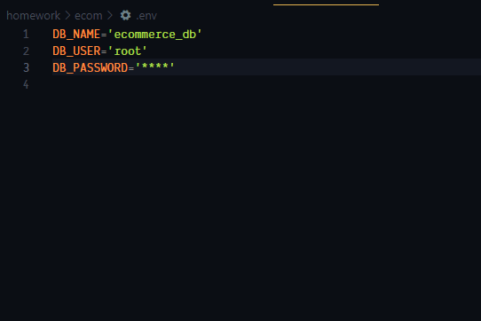

# Team Ecom System

## Description

Small api to keep track of products, their stock, price and category they belong to. This is done with a mysql database in the back end and some javascript up front.

## Table Of Cotents

- [Requirements](#requirments)
- [Installation](#installation)
- [Usage](#Usage)

## Requirments

To run this you need to hae npm installed and nodejs installed and a mysql database.

## Installation
To get this up and runing simply download the repo. Extract and navigate your browser to the location of the index.js. Run `npm install` to get the required `npm modules`.

## Usage
Very simple to use first navigate to the folder where it was extracted to. Then navigate to the .env file and change it to fit your enviorment. 

Next navigate to the seeds folder and run `node index`. This will populate the database.

Next navigate back up one directory by typing `cd ..` then run `node server` to start it.

Then you can use what ever method you would like to interface with the API. [Here](https://app.castify.com/view/7a724b3d-6afb-4fa3-a653-69e0fdbda681) is a video demoing Insomnia.

